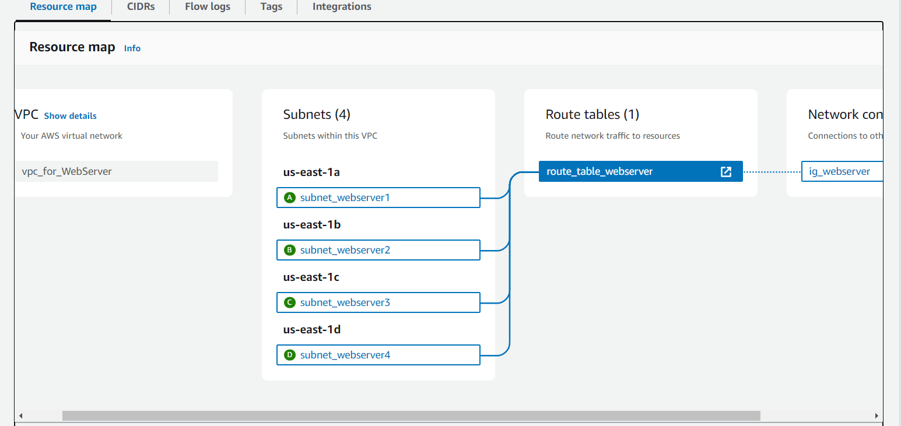

# what AWS VPC?

## VPC -> Amazon Virtual Private Cloud (Amazon VPC)

  

## Subnets -> A subnet is a range of IP addresses in your VPC

## Routing -> Use route tables to determine where network traffic from your subnet or gateway is directed.

## internet gateway->  A gateway connects your VPC to another network. For example, use an internet gateway to connect your VPC to the internet. 
## NAT Gateway ->  Network Address Translation (NAT) NAT gateway so that instances in a private subnet can connect to services outside your VPC but external services cannot initiate a connection with those instances.

## NACL -> Network Access Control List
 ### NACL Apply at subnet level 
 ### security group for allow traffic but NACL For deny and allow traffic  
 ### vpc -> subnet -> route table -> internet gateway -> security group -> nacl +api ->last point 

 ## Route 53 -> A reliable way to route users to internet applications. Amazon Route 53 is a highly available and scalable cloud Domain Name System (DNS) web service.

 Domain names, Hosted zones ,Health checks , Traffic flow, Resolver
