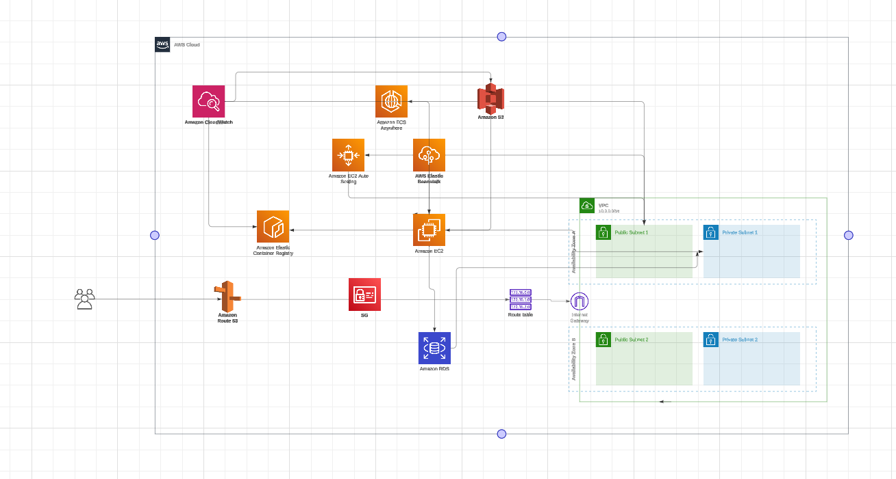

## Flutter frontend and Spring Boot backend deployed on AWS

  

<a href="https://lucid.app/lucidchart/01542bb8-fa45-4a04-a3b7-3b49f0f9f74f/edit?viewport_loc=-1455%2C-200%2C3493%2C1615%2C0_0&invitationId=inv_96ef409f-195d-42a4-9085-d418d63140f4">link</a>

Estimating the cost for your **end-to-end DevOps project** using **AWS Elastic Beanstalk** for the **Spring Boot backend** and **Amazon ECS** for the **Flutter frontend**, targeting **5,000 to 10,000 users**, can vary based on multiple factors such as instance types, usage patterns, and data transfer. Below is a detailed breakdown of the estimated monthly costs for each component involved in your architecture.

### **Estimated Monthly Cost Breakdown**

| **Service**                         | **Description**                                          | **Estimated Monthly Cost (USD)** |
|-------------------------------------|---------------------------------------------------------|-----------------------------------|
| **Elastic Beanstalk**               | EC2 instances for Spring Boot backend                   |                                   |
| - EC2 Instance (t3.medium)          | 1 instance (2 vCPUs, 4 GiB RAM)                        | $30                                |
| - Load Balancer                     | For distributing traffic to EC2 instances               | $18                                |
| **Amazon ECS**                      | Container service for Flutter frontend                  |                                   |
| - Fargate Pricing                   | Assuming 2 vCPUs and 4 GiB of memory for one task      | $72.07                             |
| **Amazon ECR**                      | Container registry for storing images                   | $0.50 (assuming 5 GB of storage) |
| **Amazon RDS**                      | Managed database service for application data            |                                   |
| - DB Instance (db.t3.medium)       | (2 vCPUs, 4 GiB RAM)                                   | $30                                |
| - Storage (30 GB)                  | SSD storage                                            | $3                                 |
| **Amazon S3**                       | For static assets (optional)                            | $1.15 (assuming 50 GB)           |
| **Amazon Route 53**                | Domain management and DNS services                      | $0.90                              |
| **Amazon CloudWatch**               | Monitoring and logging services                         | $10                                 |
| **AWS Data Transfer**               | Outbound data transfer (200 GB)                        | $18                                 |
| **VPC and Security Groups**         | No direct costs, included in other services            |                                   |

### **Total Estimated Monthly Cost**

| **Total**                           | **Estimated Monthly Cost (USD)** |
|-------------------------------------|-----------------------------------|
| **Elastic Beanstalk**               | $48                              |
| **Amazon ECS**                      | $72.07                           |
| **Amazon ECR**                      | $0.50                            |
| **Amazon RDS**                      | $33 (DB + Storage)              |
| **Amazon S3**                       | $1.15                            |
| **Amazon Route 53**                | $0.90                            |
| **Amazon CloudWatch**               | $10                              |
| **AWS Data Transfer**               | $18                              |
| **Total Estimated Cost**            | **$182.62**                      |

### **Key Considerations**
1. **Instance Types**: The costs can vary significantly based on the EC2 instance types chosen for Elastic Beanstalk and RDS.
2. **Scaling**: If you plan to use auto-scaling features for either ECS or Elastic Beanstalk, costs can increase during peak usage.
3. **Data Transfer**: If your application generates more outbound data, this can affect the overall cost.
4. **Load Balancing**: Using additional load balancers for ECS might also incur extra costs.

### **Conclusion**
The total estimated monthly cost for your AWS infrastructure for the **end-to-end DevOps project** is approximately **$182.62**. 

To optimize costs for your **end-to-end DevOps setup** on AWS while still targeting **5,000 to 10,000 users**, consider the following strategies to reduce expenses across your architecture. Below is a revised approach with cost-saving measures:

### **Cost-Reduction Strategies**

1. **Choose Smaller EC2 Instances**:
   - Instead of **t3.medium**, consider using a smaller instance type (e.g., **t3.micro** or **t3.small**) for both Elastic Beanstalk and RDS, particularly if your applications can run efficiently on lower specifications.
   - This can lead to significant savings.

2. **Use AWS Fargate Sparingly**:
   - Limit the number of concurrent tasks running in **ECS** and use a smaller configuration (e.g., 0.5 vCPUs and 1 GiB RAM) when possible.
   - Only run tasks that are necessary for handling peak loads.

3. **Optimize RDS Usage**:
   - Choose **RDS Aurora Serverless** if applicable, which automatically scales based on demand and can save costs during low usage.
   - Use lower-tier database instances (e.g., **db.t3.micro**) for development or testing environments.

4. **Leverage Spot Instances**:
   - Use **Spot Instances** for non-critical workloads or batch processing, which can save up to 90% compared to on-demand pricing.

5. **Implement Auto-Scaling**:
   - Set up auto-scaling for both Elastic Beanstalk and ECS to ensure you are only using the resources you need during peak times and scale down during off-peak times.

6. **Reduce Data Transfer Costs**:
   - Minimize unnecessary data transfer between services and optimize your application to reduce bandwidth usage.

7. **Limit CloudWatch Metrics**:
   - Use basic monitoring instead of detailed monitoring for your resources to keep CloudWatch costs lower.

8. **Utilize AWS Free Tier**:
   - If applicable, take advantage of AWS Free Tier offers for your first 12 months, which may include certain services free of charge.

### **Revised Cost Breakdown**

Here’s a revised breakdown considering cost-saving measures:

| **Service**                         | **Description**                                          | **Estimated Monthly Cost (USD)** |
|-------------------------------------|---------------------------------------------------------|-----------------------------------|
| **Elastic Beanstalk**               | EC2 instances for Spring Boot backend                   |                                   |
| - EC2 Instance (t3.micro)          | 1 instance (1 vCPU, 1 GiB RAM)                        | $8.50                             |
| - Load Balancer                     | For distributing traffic to EC2 instances               | $18                                |
| **Amazon ECS**                      | Container service for Flutter frontend                  |                                   |
| - Fargate Pricing                   | Assuming 0.5 vCPUs and 1 GiB of memory for one task    | $36.03                            |
| **Amazon ECR**                      | Container registry for storing images                   | $0.50 (assuming 5 GB of storage) |
| **Amazon RDS**                      | Managed database service for application data            |                                   |
| - DB Instance (db.t3.micro)        | (1 vCPU, 1 GiB RAM)                                   | $15                                |
| - Storage (30 GB)                  | SSD storage                                            | $3                                 |
| **Amazon S3**                       | For static assets (optional)                            | $1.15 (assuming 50 GB)           |
| **Amazon Route 53**                | Domain management and DNS services                      | $0.90                              |
| **Amazon CloudWatch**               | Monitoring and logging services                         | $5                                 |
| **AWS Data Transfer**               | Outbound data transfer (100 GB)                        | $9                                 |
| **VPC and Security Groups**         | No direct costs, included in other services            |                                   |

### **Total Estimated Monthly Cost After Optimization**

| **Total**                           | **Estimated Monthly Cost (USD)** |
|-------------------------------------|-----------------------------------|
| **Elastic Beanstalk**               | $26.50                          |
| **Amazon ECS**                      | $36.03                           |
| **Amazon ECR**                      | $0.50                            |
| **Amazon RDS**                      | $18 (DB + Storage)              |
| **Amazon S3**                       | $1.15                            |
| **Amazon Route 53**                | $0.90                            |
| **Amazon CloudWatch**               | $5                                |
| **AWS Data Transfer**               | $9                                |
| **Total Estimated Cost**            | **$97.08**                       |

### **Key Takeaways**
- **Total Estimated Cost**: After implementing the above optimizations, the total estimated monthly cost is approximately **$97.08**.
- **Scalability**: Ensure your application can handle traffic spikes through auto-scaling, while keeping costs under control.
- **Monitoring**: Use AWS Cost Explorer to track spending and adjust your resources as needed.

By employing these cost-saving strategies, you can maintain a scalable and efficient AWS architecture for your project while minimizing expenses.